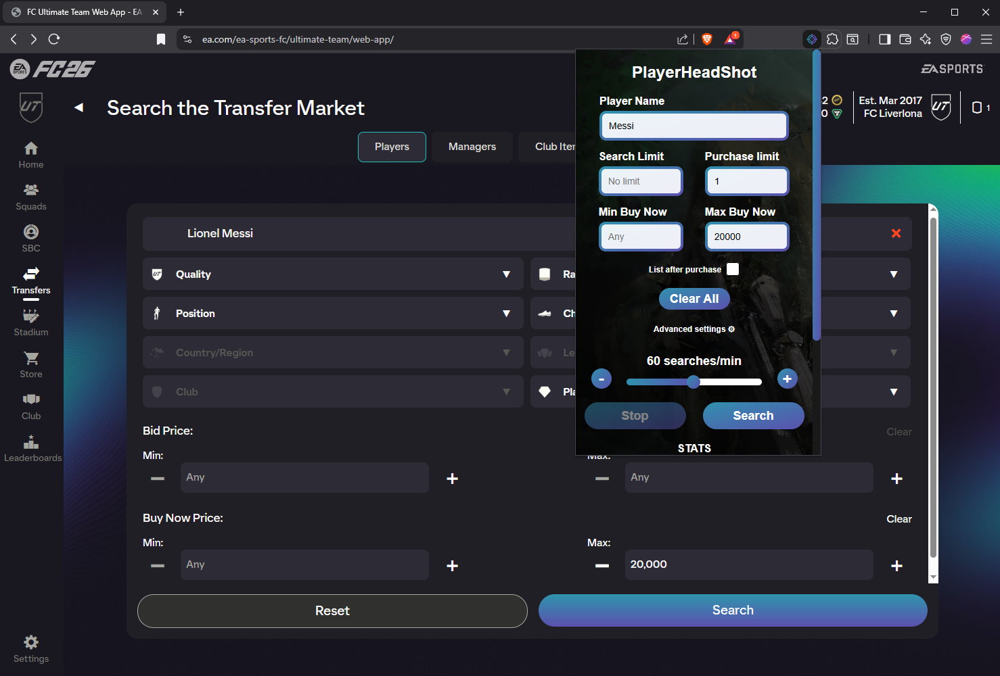

# PlayerHeadShot
Free EAFC 25 Sniper Bot with open source code.
- Written by: Jens Christian Aanestad

## Some screenshots from the extension




## Installation guide
Note: This extension will only work on Google Chrome.
These are the steps you will need to follow:
1. **Clone the repository or download the zip file and extract it to your preferred folder.** 
2. **Open Google Chrome.** 
3. **Go to [Manage Extensions](chrome://extensions/) and enable Developer Mode (in the top right corner).** 
4. **Press 'Load unpacked' (in the top left corner) and browse to the "player_head_shot" folder.** 
5. **IMPORTANT: Don't select the "player_head_shot" folder, but instead, select the "player_head_shot/dist" folder.** 
6. **Turn on the extension.**

Now, you should be able to open this extension in the EA companion app.
A quick demonstration of this installation can be found [here]().

## Further Development

If you would like to take this extension further, follow the steps below to continue developing and improve this extension.

### Prerequisites

Before proceeding, ensure you have the following installed on your machine:

- [Node.js](https://nodejs.org/en/download/prebuilt-installer): This will also install npm (Node Package Manager), which is required to install and manage dependencies.

### Setup and Build Commands

Once Node.js is installed, you can set up and build the project using the following commands:

1. **Clone the project (assuming you have git installed):**
```bash
git clone https://github.com/jenscaa/player_head_shot.git
```

2. **Navigate to the project directory:**
```bash
cd player_head_shot
```

3. **Install Vue:**
```bash
npm i vue
```

4. **Install Vite:**
```bash
npm i vite
```

5. **Install vite-plugin-static-copy (for copying static files):**
```bash
npm install vite-plugin-static-copy --save-dev
```

6. **Build the project:**
```bash
npm run build
```
This will create a dist folder containing the final build of the Chrome extension.